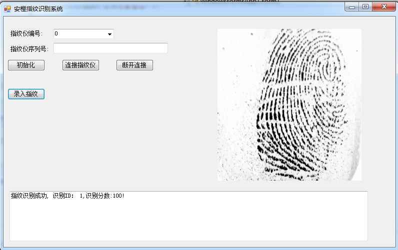

### zk4500指纹仪，适用于安橙网排课系统。

实现登记、比对指纹模板功能，登记完后同时获取9.0和10.0算法指纹模板。比对时需要选择9.0还是10.0进行比对(支持1:1和1:N比对)。实现了对红灯、绿灯、Beep的控制

### 数据库,在App.config里面配置zxz_data.mdb

  <connectionStrings>
    <add name="zxz" connectionString="Provider=Microsoft.Jet.OLEDB.4.0;Data Source=zxz_data.mdb"
        providerName="System.Data.Oledb" />
  </connectionStrings>

### 存储数据表

UserId：用户ID，
fingerindex：
,template_10，template_9，autoid