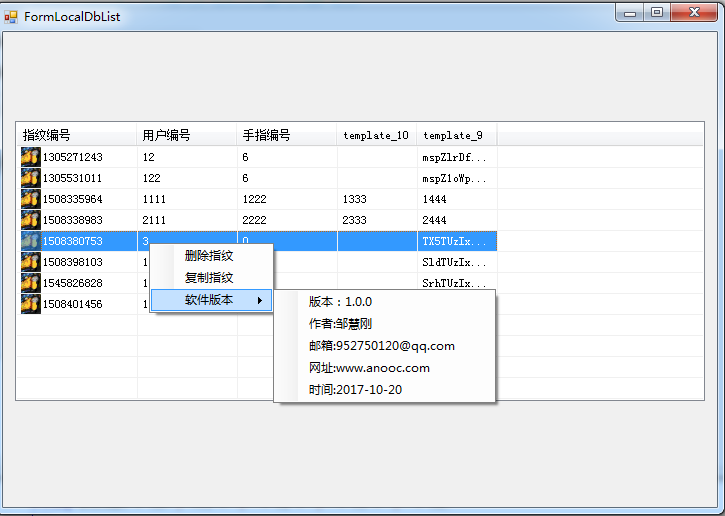

### zk4500指纹仪，适用于安橙网排课系统。

实现登记、比对指纹模板功能，登记完后同时获取9.0和10.0算法指纹模板。比对时需要选择9.0还是10.0进行比对(支持1:1和1:N比对)。实现了对红灯、绿灯、Beep的控制

### 数据库,在App.config里面配置zxz_data.mdb

  <connectionStrings>
    <add name="zxz" connectionString="Provider=Microsoft.Jet.OLEDB.4.0;Data Source=zxz_data.mdb"
        providerName="System.Data.Oledb" />
  </connectionStrings>

### 存储数据表

	autoid int 自增ID 
	userid int 用户ID,远程数据库中的用户ID，
	fingerindex int 哪个手指，手指的编号,
	template_10 string Base64图片字符串，
	template_9 string Base64图片字符串

其中fingerindex为手指编号:

				case "左手小拇指": fingerindex = 0; break;
                case "左手无名指": fingerindex = 1; break;
                case "左手中指": fingerindex = 2; break;
                case "左手食指": fingerindex = 3; break;
                case "左手大拇指": fingerindex = 4; break;
                case "右手大拇指": fingerindex = 5; break;
                case "右手食指": fingerindex = 6; break;
                case "右手中指": fingerindex = 7; break;
                case "右手无名指": fingerindex = 8; break;
                case "右手小拇指": fingerindex = 9; break;
                default: fingerindex = 0; break;

